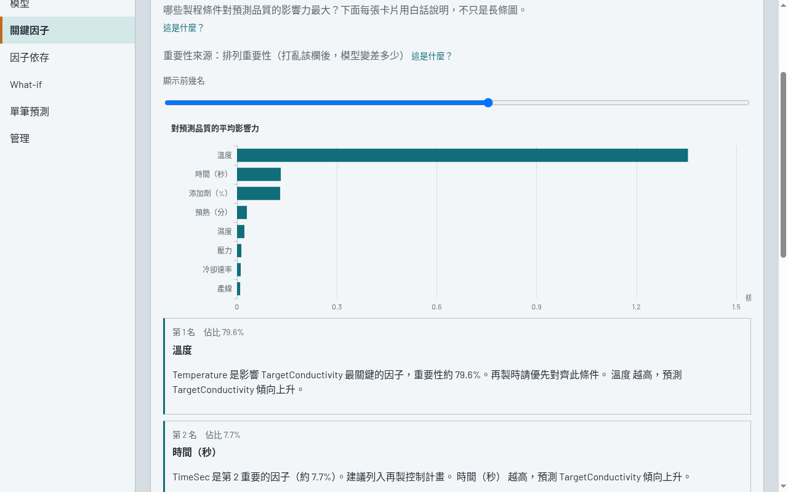
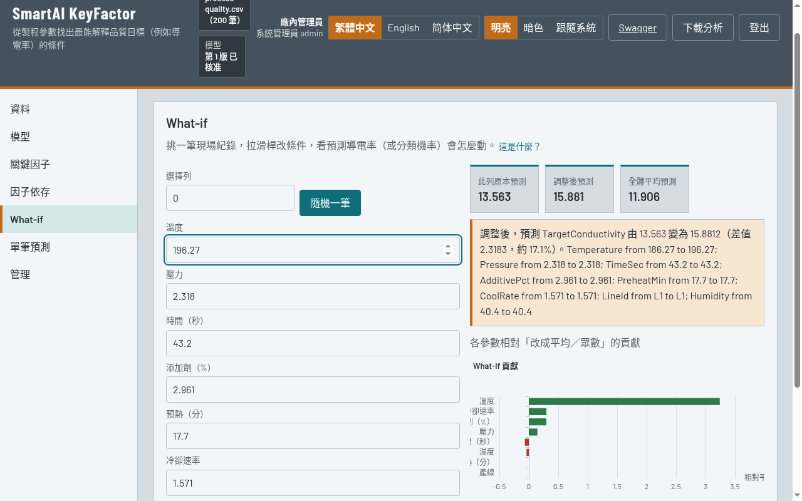
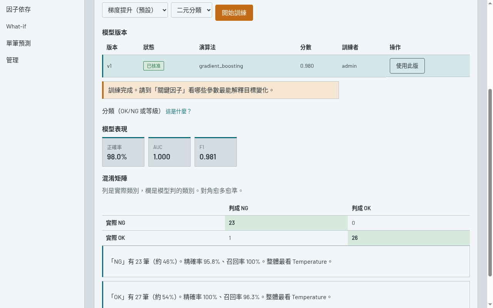

# CoolE KeyFactor

**廠務 QC 儀表板（plant-floor QC dashboard）。** 把再製造或產線的 CSV 製程資料送進來，系統用 Python **scikit-learn（sklearn）** 的 **Gradient Boosting** 或 **Random Forest** 訓練，再用 **permutation importance**（排列重要性／feature importance）排出關鍵因子，用 **partial dependence**（因子依存）看單一參數怎麼牽動品質預測。調整條件可做 What-if；模型需經品保核准後，才作為現場依據。

不是分析師的筆記本工具，而是**品保、研發與製程工程**在產線上就能使用的操作介面。免費版含：登入與角色、訓練、關鍵因子、因子依存、What-if、單筆預測、管理（帳號與稽核）。介面預設繁體中文，可切換 English / 简体中文。

**技術組成：** ASP.NET Core（C#）、Vue 3、ECharts、EF Core、SQLite／SQL Server、Python（scikit-learn）。主機用 C# 對外提供服務；畫面是 Vue 與 ECharts；資料預設 SQLite，同一套 EF Core 可改接 SQL Server。解釋層走 sklearn `permutation_importance` 與 `partial_dependence`，不必另裝 SHAP。

[安裝](#五分鐘裝起來) · [它解決什麼](#它解決什麼) · [街口贊助](#贊助) · [English](README.en.md)



以再製造導電率範例訓練後：決定係數 R² **0.825**、均方根誤差 RMSE **0.945**。影響最大的因子是溫度（約 **79.6%**），添加劑並不是主因。

---

## 它解決什麼

產線上溫度、壓力、時間、添加劑、濕度同時在變。良率下滑時，會議上各有說法：有人主張增加添加劑，有人主張延長持壓時間。現場缺少一份大家都能接受的優先順序：應該先調整哪一項參數。

ExplainerDashboard、Shapash 這類分析工具算得出 permutation importance 與偏依存，但很難直接進廠使用：沒有廠內帳號與權限、沒有模型核准流程、沒有操作稽核，畫面也不適合值班人員操作。

CoolE KeyFactor 把同一套 machine learning 解釋做成檢驗台：

1. **結果先用白話寫清楚** — 例如「溫度大約占 80%，再製造時請先把溫度對齊。」圖表用來核對，不是唯一說明。
2. **先模擬，再改產線條件** — 在 What-if 調整參數，看導電率預測由 13.56 變為 15.88，確認方向後再改 SOP 或機台設定。
3. **通過核准才能作為現場標準** — 工程師完成訓練後，模型先以草稿保存；經品保或管理員核准後，才成為現場可引用的正式版本。訓練、核准與退回都會寫入稽核紀錄，之後可以查是哪一位工程師提出、哪一位主管核准。

適用範圍：再製造、導電膠／電極、塗佈、烘烤、組裝後品質，以及其他需要盯製程品質（process quality）的產線。品質目標可以是連續值（例如導電率），也可以是類別（OK／NG、返工／報廢、A／B／C）。

---

## 現場一天怎麼用

1. **資料** — 上傳現場 CSV，或一鍵載入再製造範例、OK／NG 範例。
2. **模型** — 選擇自動判斷、迴歸、二元分類或多類分類；演算法為 sklearn Gradient Boosting 或 Random Forest。分類結果會顯示混淆矩陣，以及每一類的精確率。
3. **關鍵因子** — 以 permutation importance 排出 feature importance；白話說明應該優先控制哪一項參數，以及它大約佔多少影響力。
4. **因子依存** — sklearn partial dependence：固定其他條件，只變動一項參數，觀察品質預測的走勢。
5. **What-if（假設分析）** — 調整製程條件，比較調整前後的預測值；也可指定某一筆現場紀錄作為起點。
6. **單筆預測** — 每一筆實際值與模型預測；點列可跳到 What-if。





內建廠內角色：系統管理員、工程師、品保、唯讀。唯讀帳號只能查看結果，不能訓練模型或送出模擬。管理員可開帳號、改角色，並查看稽核。

---

## 五分鐘裝起來

需要 **.NET 8 SDK** 與 **Python 3.11+**。只有要修改畫面時才需要 Node 20+。這個 repo 已包含編譯完成的前端，clone 之後可以直接執行。

```bash
git clone https://github.com/pigqig/CoolE-AI-KeyFactor.git
cd CoolE-AI-KeyFactor

python3 -m venv python/.venv
source python/.venv/bin/activate          # Windows: python\.venv\Scripts\activate
pip install -r python/requirements.txt

dotnet run --project src/KeyFactorDashboard
```

瀏覽器開啟 http://127.0.0.1:43123

| | |
| --- | --- |
| 第一次登入 | `admin` / `ChangeMe!123`（請立刻變更密碼，或到「管理」新增工程師、品保帳號） |
| 想立刻看到分析結果 | 登入後按「載入範例資料」，再執行訓練 |
| 要看 OK／NG 分類示範 | 按「載入 OK/NG 範例」 |

進階設定（修改畫面、改接 SQL Server、機台 API）見 [docs/USAGE.md](docs/USAGE.md)。

---

## 贊助

廠務常會碰到這幾種早晨：

- **夜班良率掉了。** 早班會議各有說法：加添加劑、延長持壓、改烘烤。把當班 CSV 送進檢驗台，訓練後看關鍵因子，至少先有一份大家能看的優先順序，而不是再吵一輪。
- **再製造導電率對不上。** 製程怪添加劑，品保盯溫度。先在 What-if 改一項、看預測怎麼走，再決定要不要動機台。
- **這批到底 OK 還是 NG。** 值班與品保各執一詞。訓練分類、看混淆矩陣，比較容易對齊「模型常在哪一類失手」，而不是只靠印象。
- **機台設定還沒改。** 品保要一份共用的優先順序：先控哪一項；工程師的模型先當草稿，核准後才當成現場依據。

如果其中一個畫面你遇過，而這套免費檢驗台剛好讓會議少吵一輪——願意的話，用街口請我喝杯咖啡。沒有也沒關係，免費版本來就給現場用。

1. 打開街口支付，或任何支援 TWQR 的銀行／電子支付 App
2. 掃描下方收款碼
3. 或在街口支付輸入街口代碼 **`3966`**（小言）

也可以從 GitHub 右上角 Sponsor 按鈕連到同一頁：[pigqig#sponsor](https://github.com/pigqig#sponsor)


合作、授權或客製需求：<pigqig@gmail.com>（主旨請寫 KeyFactor）

---

## 作者

**Joseph_Li** · 酷意 AI  
郵件：[pigqig@gmail.com](mailto:pigqig@gmail.com)  
網站：[ourcoolidea.com](http://ourcoolidea.com)

[MIT](LICENSE) © 2026 Joseph_Li

畫面靈感來自 [explainerdashboard](https://github.com/oegedijk/explainerdashboard)（MIT）。
